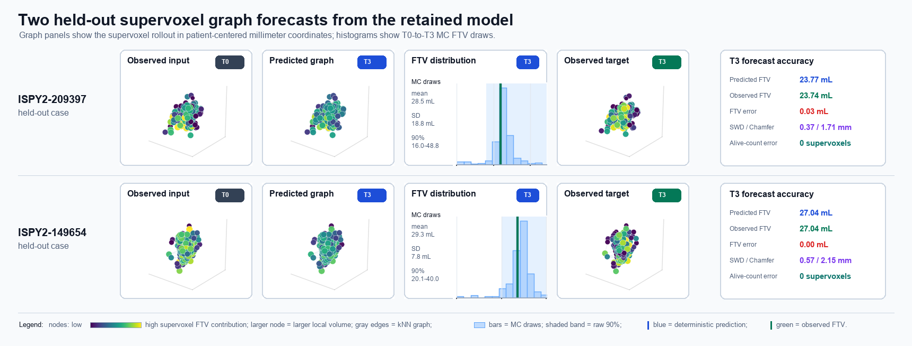
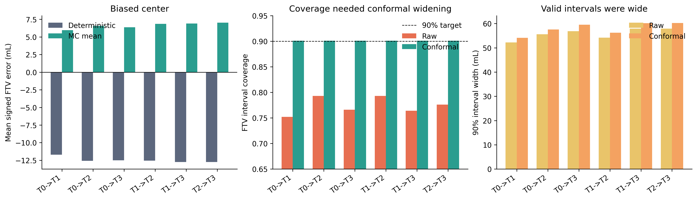

# Calibrated Graph Rollouts for Breast DCE-MRI

This repository packages the code, derived data products, model checkpoints,
figures, and paper materials for the breast DCE-MRI graph rollout forecasting
study.

The retained model is `bio_ftv020_alive005`, a scheduled-sampling graph
convolutional rollout model calibrated with endpoint functional tumor volume
(FTV) and alive-supervoxel supervision. The main evaluation compares this model
against the previous scheduled-sampling rollout baseline using deterministic
T3 forecasts and conditional Monte Carlo simulations.

## Figure Highlights

The full paper figures are under `paper/figures/`. The README only shows two
representative panels: one visual example of the graph rollout task and one
summary of the Monte Carlo calibration result.

**Patient-level graph forecasts.** Two held-out examples show observed and
forecasted supervoxel graphs across visits. The center panel summarizes each
patient's observed and predicted FTV trajectory.



**Conditional Monte Carlo calibration.** The MC comparison tracks bias,
coverage, and interval width across conditioning horizons for the baseline and
the retained biology-calibrated model.



## Repository Layout

The repository is organized around one pipeline:

```text
derived graph tensors -> trained rollout checkpoints -> deterministic/MC results
                      -> notebooks and plotting scripts -> paper figures/tables
```

| Path | What it contains | How it connects |
| --- | --- | --- |
| `data/ispy2/` | Derived cohort metadata, cross-validation folds, audits, and 758 patient-level graph tensors in `graphs_consistent/*.pt`. | These files are the model inputs. They are derived supervoxel graphs, not raw MRI volumes. |
| `src/lsgc/` | Local graph convolutional modeling package: graph layers, forecaster, matching utilities, metrics, and tests. | Imported by the training, evaluation, Monte Carlo, notebook, and figure scripts. |
| `experiments/preprocessing/` | Scripts that build/register the consistent graph representation. | Produces the derived graph tensors stored under `data/ispy2/`. |
| `experiments/stage1_forecaster/` | Training and deterministic evaluation scripts for the scheduled-sampling rollout models. | Uses `data/ispy2/` and `src/lsgc/`, writes fold checkpoints and evaluation summaries. |
| `experiments/consistent_rollout/` | Conditional Monte Carlo runner, Slurm wrappers, summarizer, and tests. | Uses trained checkpoints plus held-out fold graphs to generate MC samples, calibration summaries, and patient-level result tables. |
| `models/` | Fold checkpoints and training logs for the baseline, primary retained model, and controls. | These checkpoints are loaded by deterministic evaluation, MC simulation, and figure-generation scripts. |
| `results/` | Derived deterministic and Monte Carlo outputs: summaries, calibration JSON, per-patient tables, MC draws, subgroup summaries, and notebook exports. | These are the main quantitative artifacts used by notebooks and the paper. |
| `notebooks/` | Analysis notebooks and small notebook helper modules. | Used for exploratory comparison, result interpretation, and export of paper-ready tables/figures. |
| `paper/` | LaTeX source, compiled paper PDF, references, figure scripts, generated figures, and paper tables. | This is the paper package assembled from the checkpoints, result tables, and figure-generation scripts. |
| `docs/` | Progress notes, model-change notes, reproducibility notes, and experiment plans. | Documents the reasoning that led from the baseline model to the retained biology-calibrated model. |
| `cradle/` | Cluster notes, queue guidance, and setup references for Cradle runs. | Records how the training and MC jobs were launched on the cluster. |
| `environment/` | Minimal environment notes and dependency list. | Gives the package requirements needed to rerun the analyses. |

The root-level compatibility links keep the copied scripts runnable with the
same paths used during development:

| Link | Target | Purpose |
| --- | --- | --- |
| `lsgc` | `src/lsgc` | Lets scripts import `lsgc` from the repository root. |
| `reports` | `results` | Preserves older script paths that wrote to `reports/`. |
| `datasets/ispy2` | `data/ispy2` | Preserves older dataset paths used by preprocessing and evaluation scripts. |
| `runs/consistent_forecaster_v2/...` | `models/...` | Preserves checkpoint paths used by existing rollout and MC scripts. |

## Important Files

| File | Role |
| --- | --- |
| `paper/main.tex` | Main LaTeX source for the paper. |
| `paper/bio_ftv020_mc_manuscript.pdf` | Current compiled paper PDF. |
| `paper/make_manuscript_support.py` | Builds paper support figures and CSV tables from saved results. |
| `paper/make_retained_graph_forecast_figure.py` | Builds the two-patient graph rollout figure from checkpoints, graph tensors, and saved MC outputs. |
| `experiments/stage1_forecaster/train_consistent_forecaster_v2.py` | Main training entry point for the consistent rollout models. |
| `experiments/stage1_forecaster/eval_consistent_forecaster.py` | Deterministic rollout evaluation entry point. |
| `experiments/consistent_rollout/run_conditional_mc.py` | Conditional Monte Carlo simulation entry point. |
| `experiments/consistent_rollout/run_conditional_mc_bio_retrained_grid.sbatch` | Slurm array wrapper for the retained-model MC runs. |
| `experiments/consistent_rollout/summarize_conditional_mc_bio_retrained.py` | Summarizes baseline and retained MC outputs into comparison tables. |
| `notebooks/consistent_rollout_bio_retraining_results.ipynb` | Main analysis notebook comparing baseline, retained deterministic results, and MC simulations. |
| `data/DATA_MANIFEST.md` | Describes included derived data and excluded raw imaging files. |
| `models/MODEL_MANIFEST.md` | Describes the included baseline, retained, and control model checkpoints. |

## Main Paper Build

From the repository root:

```bash
cd paper
latexmk -pdf -interaction=nonstopmode main.tex
```

The compiled PDF is also included as:

```text
paper/bio_ftv020_mc_manuscript.pdf
```

## Key Results

The main result artifacts are:

```text
results/consistent_forecaster_v2_bio_eval/notebook_exports/
results/conditional_mc_consistent_rollout/
results/conditional_mc_bio_retrained/
```

The primary model result is:

```text
results/conditional_mc_bio_retrained/bio_ftv020_alive005/
```

The two control runs are:

```text
results/conditional_mc_bio_retrained/bio_ftv010_alive000/
results/conditional_mc_bio_retrained/bio_ftv010_alive002/
```

## Reproducing the Figure Panels

The two-patient graph forecast figure is generated from the retained fold
checkpoints, derived graph tensors, and saved MC outputs:

```bash
python paper/make_retained_graph_forecast_figure.py
```

The manuscript support figures and tables are generated by:

```bash
python paper/make_manuscript_support.py
```

## Reproducing Conditional Monte Carlo Evaluation

The retained MC runs used:

- `N_MC=256`
- `METRIC_DRAWS=0`
- all start visits: T0, T1, T2
- held-out fold protocol
- same 758-patient graph cohort

The core runner is:

```text
experiments/consistent_rollout/run_conditional_mc.py
```

The retained-model Slurm array wrapper is:

```text
experiments/consistent_rollout/run_conditional_mc_bio_retrained_grid.sbatch
```

The summarizer is:

```text
experiments/consistent_rollout/summarize_conditional_mc_bio_retrained.py
```

## Data Status

This repository is intended as a private project repository. It includes derived
supervoxel graph tensors and patient-level derived results, but it does not
include raw MRI image volumes.

See:

```text
data/DATA_MANIFEST.md
models/MODEL_MANIFEST.md
```

## Environment

The minimal package list for the current analysis environment is in:

```text
environment/requirements-minimal.txt
```

The source repository's longer pinned requirements file is copied as:

```text
environment_requirements_source.txt
```
